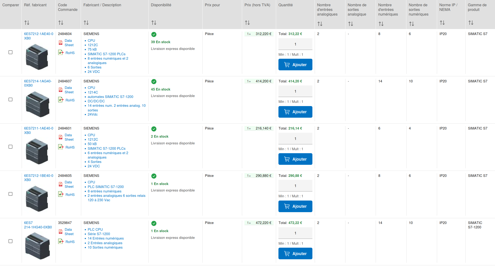
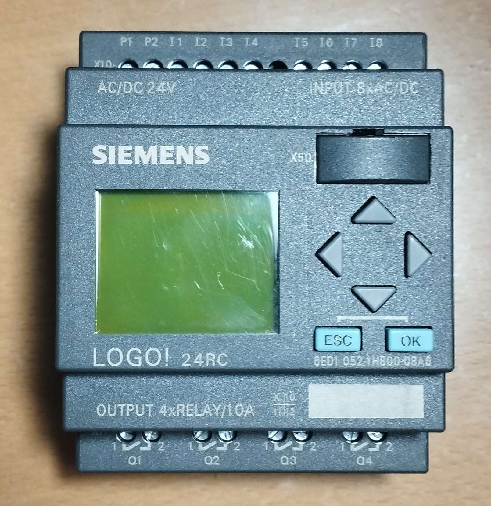
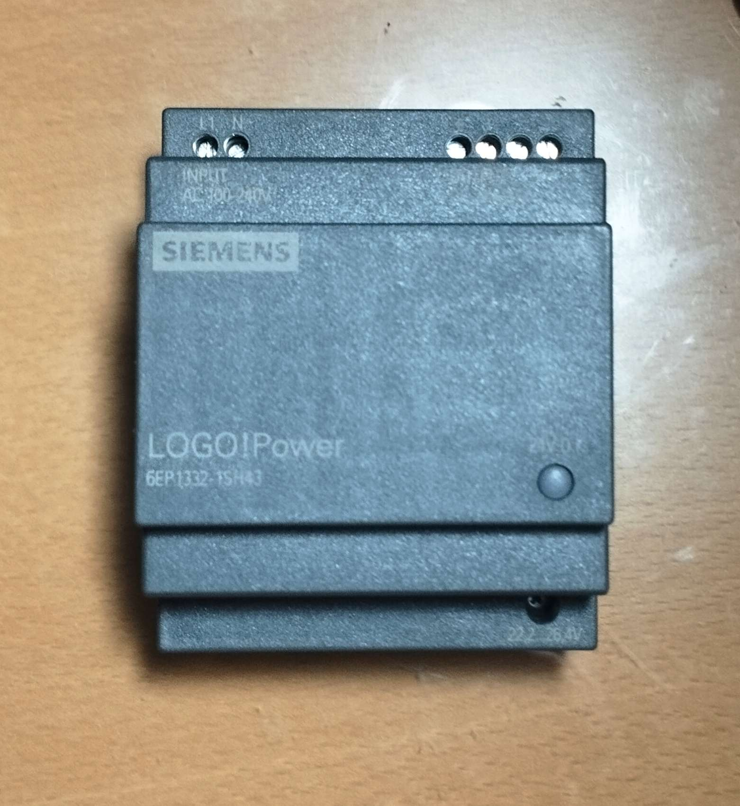
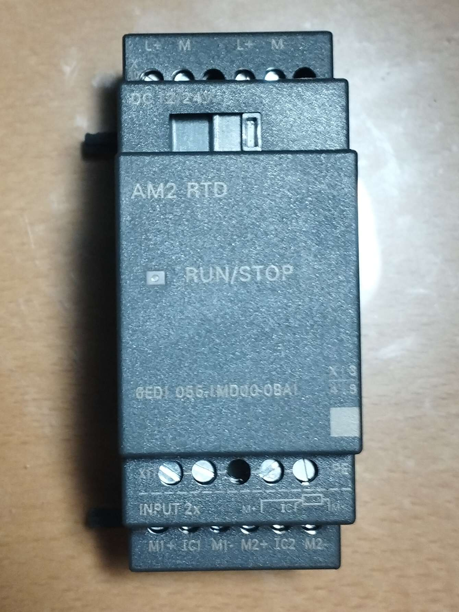
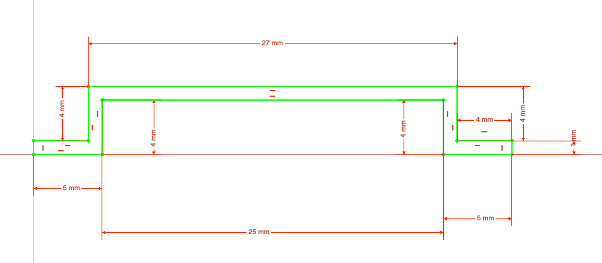
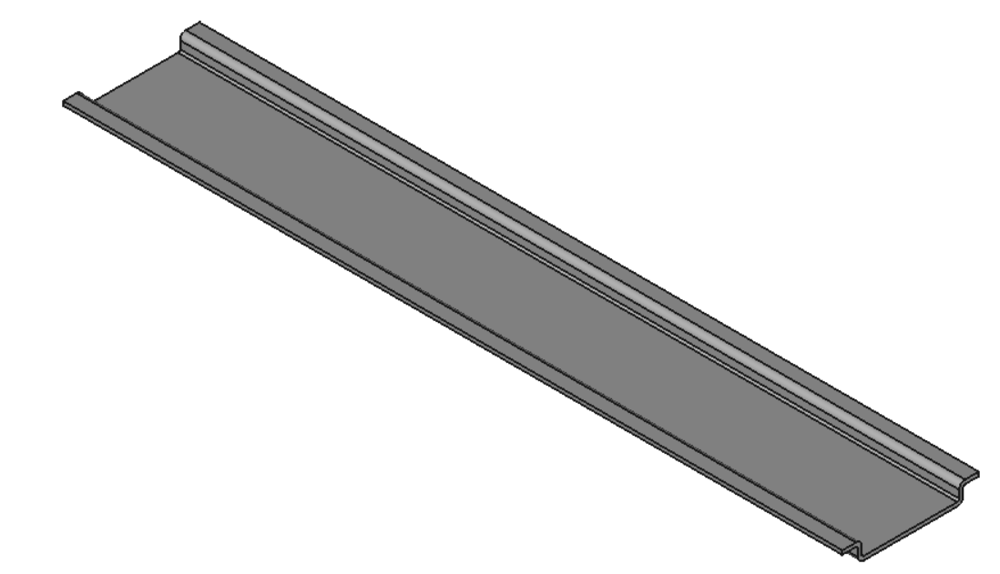
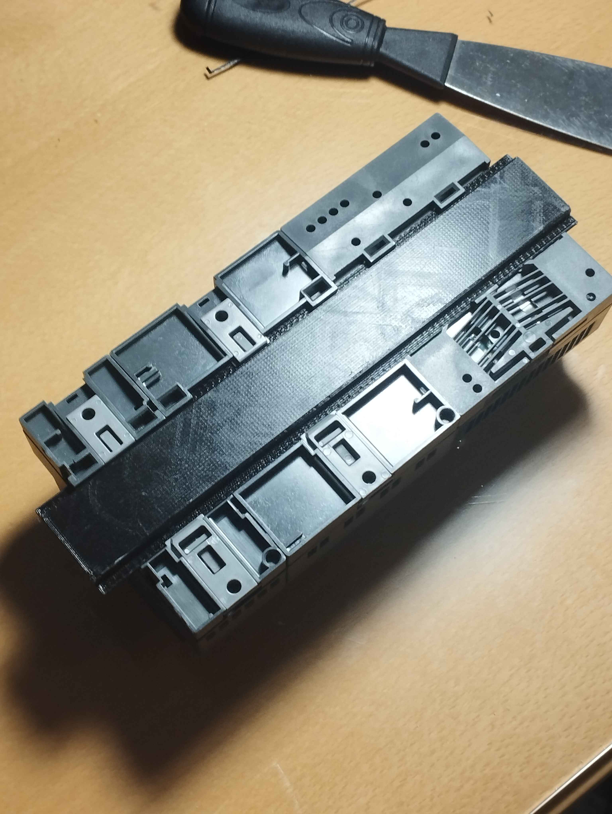
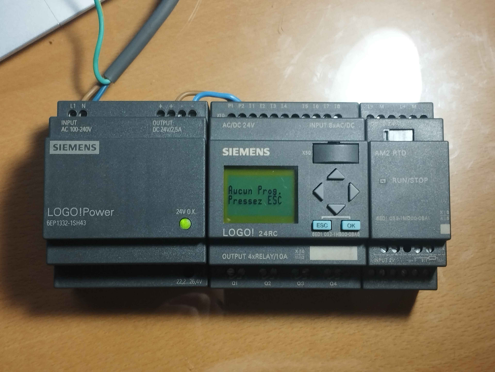

# Projet DomoPLC

## Objectif du projet
L'objectif est de créer un système de domotique avec un PLC :
- En fonction de la luminosité :
  - Gestion des volets roulants
  - Gestion du plafonnier
- En fonction de l'heure :
	- Gestion des lumières secondaires
	- Gestion du plafonnier

Le tout dépend de ma présence, avec ces idées pour me détecter :
- Interrogation au routeur pour détecter la présence de mon smartphone
- Capteur thermique
- Capteur CO2

## Philosophie
Contrairement aux solutions domotiques classiques (Wi-Fi, cloud, apps),
ce projet repose sur un **PLC industriel** :
- fonctionnement autonome
- horlloge interne intégrée
- hardware robuste

En plus de ces avantages techniques, le choix d'un PLC permet également de développer des compétences en automatisme industriel, sur un cas réel et contraint, plutôt que de produire une solution plus flexible mais moins représentative d’un environnement industriel.

Le projet privilégie la **simplicité fonctionnelle** et la **fiabilité long terme**.

## Trouver un PLC pertinent

Afin de maintenir un environnement proche de l'industriel, il me tenait à cœur d'avoir un automate Siemens (la marque la plus répandue), mais les prix étaient souvent bien au delà de mon budget.

([fr.farnell.com](https://fr.farnell.com/c/automatismes-controle-de-process/controleurs-de-process-programmateurs-indicateurs/controleurs-logiques-programmable-plc-/plc-processeurs?brand=siemens))

Heureusement, Siemens possède une gamme plus accessible : LOGO!

## Kit SIEMENS LOGO! 24 RC
 
J'ai pu obtenir d'occasion un kit comprenant :

<li>
	<ul style="display: flex; align-items: center; gap: 20px;">
		

			<b> un LOGO! 24RC : </b>
			un automate programmable compact  alimenté en 24 V, qui combine entrées/sorties logiques, horloge et relais de sortie, conçu pour automatiser simplement de petites installations (éclairage, volets, pompes, automatismes domestiques ou industriels légers).
		

		
	</ul>
	<ul style="display: flex; align-items: center; gap: 20px;">
		

			<b>une alimentation 230V AC to 24V DC :</b>
			Un module qui convertit une tension domestique (230V alternatif) en une tension adaptée au PLC  (24V continu).
		

		
	</ul>
	<ul style="display: flex; align-items: center; gap: 20px;">
		

			<b>un module AM3 RTD</b>
			Un module permettant d'exploiter des sondes de température RTC (Resistance Temperature Detectors). Les sondes envoient une valeur de résistance (dépendante de la température) et le module la convertit en une valeur de température exploitable pour le PLC.
		

		
	</ul>
</li>
  

> **Note personnelle :**
> Il n'était pas prévu d'exploiter la température au commencement du projet mais un module de mesure étant fourni avec le PLC, une feature incluant la température de la pièce dans les prises de décision pourrait être pertinente.

  

## Mise en place

Ces modules sont conçus pour être accrochés sur un rail DIN de 35 mm de largeur. Les profondeurs standards sont souvent 7.5 mm ou 15 mm. Cependant j'ai préféré en imprimer un en 3D avec une profondeur de 5 mm pour que l'ensemble puisse être posé de manière stable.

### Modélisation

Modélisation sur FreeCAD : 

	

  

### Montage
---

	

		Après avoir imprimé la pièce en PLA sur une Creality Ender 3 v2, il suffit d'insérer le rail à l'arrière des modules pour les assembler. Le module AM2 RTD et le 24RC sont d'ailleurs prévus pour s'emboîter ensemble, via des pattes et une prise de communication latérale.
	

	

### Câblage
---

#### Alimentation 230V

Le bloc d'alimentation prend du 230V domestique en entrée avec un branchement intuitif
- Phase sur  L
- Neutre sur N

>**Pourquoi pas de fil de terre ?**
>Après quelque recherches, j'ai appris que ce module a une double isolation qui garantit qu'il est impossible pour pour câble d'exposer une tension de 230v à la surface du module (hormis les vis des câbles en question), donc aucun besoin de fil de terre.

#### Alimentation 24V

On relie l'alimentation au LOGO! 24 RC : 
- \+ sur P1
- \- sur P2
  
### Schéma récapitulatif

  

  

#### Montage final

  

Les cables utilisés proviennent d'un cable d'alimentation 230V avec un diamètre de 1.5mm, pouvant donc supporter jusqu'à 20A, largement au dessus de 2.5A maximum du moudle d'alimentation.

## Premier programme

